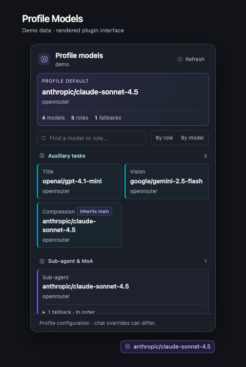

# Profile Models for Hermes Desktop

A read-only status-bar model map for Hermes Desktop. Version **1.0.1** · MIT license.

The closed chip shows the profile's configured main model. The popup lists main, auxiliary, sub-agent and MoA routes, with **By role / By model** views, search, inherited settings, disabled routes and ordered fallbacks.

## Install

Requires Hermes **0.21.5 or newer** with the Desktop plugin SDK.

1. Open **Capabilities → Plugins → Install from Git** in Hermes Desktop.
2. Enter `AllenRobinHubert/profile-models` (or the full URL of your fork).
3. Install and enable the **desktop** component. No agent/backend plugin component is needed.

For a ZIP/manual install, copy `desktop/plugin.js` to `$HERMES_HOME/desktop-plugins/profile-models/plugin.js`, then rescan or restart Hermes Desktop and enable Profile Models. Keep the directory name `profile-models` to match the exported plugin ID.

There is no build step, npm dependency installation, API key or custom backend. Hermes provides `@hermes/plugin-sdk` and React.

## Scope and compatibility

Requires Hermes Desktop's plugin SDK, status-bar registration, state atoms and `config.get` request API. `host.requestProfile` is used when available; older SDKs fall back to an explicitly profile-scoped request. If the focused-session owner atom is unavailable, the active gateway profile is displayed.

The plugin shows the **saved profile configuration**. A chat-specific model override or runtime provider fallback may differ. Inheritance describes the configured route, not a measurement of which model actually served a request.

Config requests always specify the profile. The parser retains model-routing fields only; it does not retain or render credential fields, and the plugin makes no external network requests or LLM calls. It does not edit your profile, access browser or vendor CLI login stores, store credentials, launch shell commands or background processes, or send telemetry. The host’s `config.get` response may contain settings unrelated to model routing; the parser selects routing fields immediately and never persists or displays credentials.

## Development

```sh
node tests/test_ui.cjs
hermes plugins validate . --install-deps
```

The dependency-free Node harness covers model/provider inheritance, disabled MoA presets, ordered fallbacks, model grouping, credential filtering and profile-scoped requests. `desktop/plugin.js` is the runtime entry; `package.json` records release metadata only.

## Preview



The preview uses synthetic values rendered from the plugin components with a mocked SDK popover frame; it contains no user configuration or spend history.

See [CHANGELOG.md](CHANGELOG.md). This is an independent community plugin, unaffiliated with Hermes.
